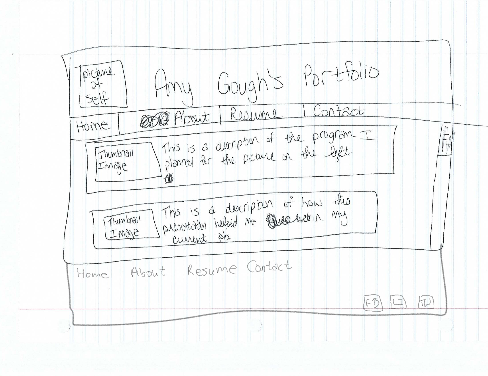
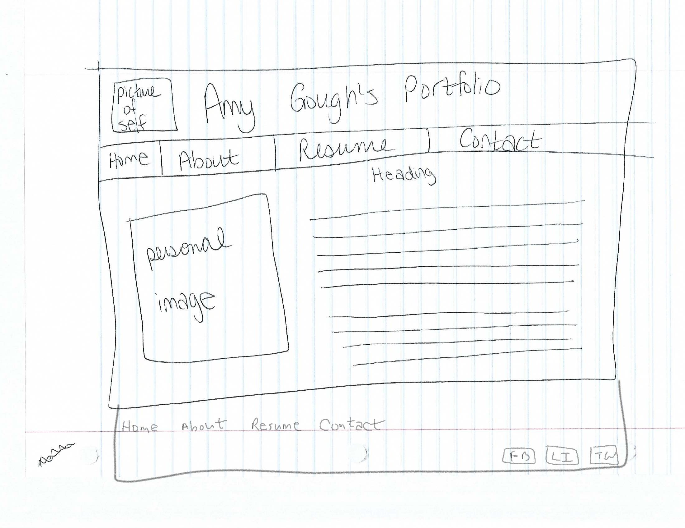
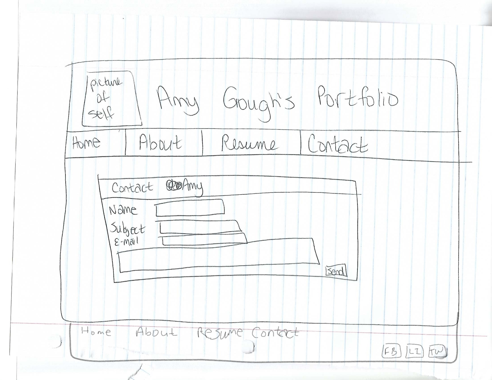

# My INF 7420 Project

I am going to be building a portfolio site. The purpose of this site will be to showcase my skills and keep my projects organized.

## Wireframes

The following is how my site will possibly be laid out.

Header - will include my name, a picture of myself, and a navigation menu

Navigation Menu - will include links to other pages, such as the Contact Me page

Main Content - will include examples of past assignments and programs I have completed

Footer - will include links to other pages, such as the About page, and links to my social media pages

Header, Navigation Menu, and Footer - are the same as the previous page

Main Content - This will feature a personal image of myself, a heading, and a paragraph or two of basic information about myself.

Header, Navigation Bar, and Footer - will be the same as the previous pages.

Main Content - will be a form with a heading, and spaces for the person's name, subject of the contacting, e-mail, and a larger space for the content with which they are contacting me.
